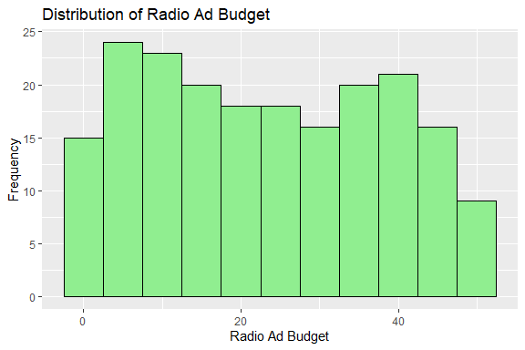
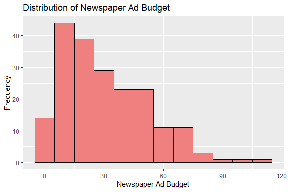
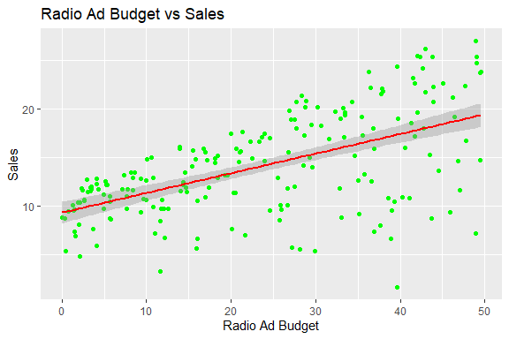

Advertising Sales Prediction
================
Trevor Okinda
2024

- [Student Details](#student-details)
- [Setup Chunk](#setup-chunk)
  - [Source:](#source)
  - [Reference:](#reference)
- [Understanding the Dataset (Exploratory Data Analysis
  (EDA))](#understanding-the-dataset-exploratory-data-analysis-eda)
  - [Loading the Dataset](#loading-the-dataset)
  - [Measures of Frequency](#measures-of-frequency)
  - [Measures of Central Tendency](#measures-of-central-tendency)
  - [Measures of Distribution](#measures-of-distribution)
  - [Measures of Relationship](#measures-of-relationship)
  - [Plots](#plots)
- [Preprocessing and Data
  Transformation](#preprocessing-and-data-transformation)
  - [Missing Values](#missing-values)
- [Training Model](#training-model)
  - [Data Splitting](#data-splitting)
  - [Bootstrapping](#bootstrapping)
  - [Cross-validation](#cross-validation)
  - [Training Different Models](#training-different-models)
  - [Performance Comparison](#performance-comparison)
  - [Saving Model](#saving-model)

# Student Details

|                       |                              |
|-----------------------|------------------------------|
| **Student ID Number** | 134780                       |
| **Student Name**      | Trevor Okinda                |
| **BBIT 4.2 Group**    | C                            |
| **Project Name**      | Advertising Sales Prediction |

# Setup Chunk

**Note:** the following KnitR options have been set as the global
defaults: <BR>
`knitr::opts_chunk$set(echo = TRUE, warning = FALSE, eval = TRUE, collapse = FALSE, tidy = TRUE)`.

More KnitR options are documented here
<https://bookdown.org/yihui/rmarkdown-cookbook/chunk-options.html> and
here <https://yihui.org/knitr/options/>.

### Source:

The dataset that was used can be downloaded here: *\<<a
href="https://www.kaggle.com/datasets/yasserh/advertising-sales-dataset\"
class="uri">https://www.kaggle.com/datasets/yasserh/advertising-sales-dataset\</a>\>*

### Reference:

*\<M Yasser H. (n.d.). Advertising Sales Dataset \[Data set\]. Kaggle.
<a
href="https://www.kaggle.com/datasets/yasserh/advertising-sales-dataset\"
class="uri">https://www.kaggle.com/datasets/yasserh/advertising-sales-dataset\</a>\>  
Refer to the APA 7th edition manual for rules on how to cite datasets:
<https://apastyle.apa.org/style-grammar-guidelines/references/examples/data-set-references>*

# Understanding the Dataset (Exploratory Data Analysis (EDA))

## Loading the Dataset

``` r
# Load dataset
AdData <- read.csv("Advertising_Budget_and_Sales.csv", colClasses = c(
  TV_Ad_Budget = "numeric",
  Radio_Ad_Budget = "numeric",
  Newspaper_Ad_Budget = "numeric",
  Sales = "numeric"
))

# Display structure to verify data types
str(AdData)
```

    ## 'data.frame':    200 obs. of  4 variables:
    ##  $ TV_Ad_Budget       : num  230.1 44.5 17.2 151.5 180.8 ...
    ##  $ Radio_Ad_Budget    : num  37.8 39.3 45.9 41.3 10.8 48.9 32.8 19.6 2.1 2.6 ...
    ##  $ Newspaper_Ad_Budget: num  69.2 45.1 69.3 58.5 58.4 75 23.5 11.6 1 21.2 ...
    ##  $ Sales              : num  22.1 10.4 9.3 18.5 12.9 7.2 11.8 13.2 4.8 10.6 ...

``` r
# Display first few rows to ensure data is loaded correctly
head(AdData)
```

    ##   TV_Ad_Budget Radio_Ad_Budget Newspaper_Ad_Budget Sales
    ## 1        230.1            37.8                69.2  22.1
    ## 2         44.5            39.3                45.1  10.4
    ## 3         17.2            45.9                69.3   9.3
    ## 4        151.5            41.3                58.5  18.5
    ## 5        180.8            10.8                58.4  12.9
    ## 6          8.7            48.9                75.0   7.2

``` r
View(AdData)
```

## Measures of Frequency

``` r
# Frequency for each budget type and sales (bins for better insight)
hist(AdData$TV_Ad_Budget, main = "Frequency of TV Ad Budget", xlab = "TV Ad Budget", col = "lightblue")
```

<!-- -->

``` r
hist(AdData$Radio_Ad_Budget, main = "Frequency of Radio Ad Budget", xlab = "Radio Ad Budget", col = "lightgreen")
```

<!-- -->

``` r
hist(AdData$Newspaper_Ad_Budget, main = "Frequency of Newspaper Ad Budget", xlab = "Newspaper Ad Budget", col = "lightcoral")
```

<!-- -->

``` r
hist(AdData$Sales, main = "Frequency of Sales", xlab = "Sales", col = "lightyellow")
```

<!-- -->

## Measures of Central Tendency

``` r
# Mean
mean_tv <- mean(AdData$TV_Ad_Budget)
mean_radio <- mean(AdData$Radio_Ad_Budget)
mean_newspaper <- mean(AdData$Newspaper_Ad_Budget)
mean_sales <- mean(AdData$Sales)

# Median
median_tv <- median(AdData$TV_Ad_Budget)
median_radio <- median(AdData$Radio_Ad_Budget)
median_newspaper <- median(AdData$Newspaper_Ad_Budget)
median_sales <- median(AdData$Sales)

# Mode function (R does not have a built-in mode function)
get_mode <- function(x) {
  uniq_vals <- unique(x)
  uniq_vals[which.max(tabulate(match(x, uniq_vals)))]
}

mode_tv <- get_mode(AdData$TV_Ad_Budget)
mode_radio <- get_mode(AdData$Radio_Ad_Budget)
mode_newspaper <- get_mode(AdData$Newspaper_Ad_Budget)
mode_sales <- get_mode(AdData$Sales)

# Display central tendency measures
list(
  Mean = c(TV = mean_tv, Radio = mean_radio, Newspaper = mean_newspaper, Sales = mean_sales),
  Median = c(TV = median_tv, Radio = median_radio, Newspaper = median_newspaper, Sales = median_sales),
  Mode = c(TV = mode_tv, Radio = mode_radio, Newspaper = mode_newspaper, Sales = mode_sales)
)
```

    ## $Mean
    ##        TV     Radio Newspaper     Sales 
    ##  147.0425   23.2640   30.5540   14.0225 
    ## 
    ## $Median
    ##        TV     Radio Newspaper     Sales 
    ##    149.75     22.90     25.75     12.90 
    ## 
    ## $Mode
    ##        TV     Radio Newspaper     Sales 
    ##      17.2       4.1       9.3       9.7

## Measures of Distribution

``` r
# Standard deviation and variance
sd_tv <- sd(AdData$TV_Ad_Budget)
var_tv <- var(AdData$TV_Ad_Budget)

sd_radio <- sd(AdData$Radio_Ad_Budget)
var_radio <- var(AdData$Radio_Ad_Budget)

sd_newspaper <- sd(AdData$Newspaper_Ad_Budget)
var_newspaper <- var(AdData$Newspaper_Ad_Budget)

sd_sales <- sd(AdData$Sales)
var_sales <- var(AdData$Sales)

# Range and Interquartile Range (IQR)
range_tv <- range(AdData$TV_Ad_Budget)
iqr_tv <- IQR(AdData$TV_Ad_Budget)

range_radio <- range(AdData$Radio_Ad_Budget)
iqr_radio <- IQR(AdData$Radio_Ad_Budget)

range_newspaper <- range(AdData$Newspaper_Ad_Budget)
iqr_newspaper <- IQR(AdData$Newspaper_Ad_Budget)

range_sales <- range(AdData$Sales)
iqr_sales <- IQR(AdData$Sales)

# Display distribution measures
list(
  Standard_Deviation = c(TV = sd_tv, Radio = sd_radio, Newspaper = sd_newspaper, Sales = sd_sales),
  Variance = c(TV = var_tv, Radio = var_radio, Newspaper = var_newspaper, Sales = var_sales),
  Range = list(TV = range_tv, Radio = range_radio, Newspaper = range_newspaper, Sales = range_sales),
  IQR = c(TV = iqr_tv, Radio = iqr_radio, Newspaper = iqr_newspaper, Sales = iqr_sales)
)
```

    ## $Standard_Deviation
    ##        TV     Radio Newspaper     Sales 
    ## 85.854236 14.846809 21.778621  5.217457 
    ## 
    ## $Variance
    ##         TV      Radio  Newspaper      Sales 
    ## 7370.94989  220.42774  474.30833   27.22185 
    ## 
    ## $Range
    ## $Range$TV
    ## [1]   0.7 296.4
    ## 
    ## $Range$Radio
    ## [1]  0.0 49.6
    ## 
    ## $Range$Newspaper
    ## [1]   0.3 114.0
    ## 
    ## $Range$Sales
    ## [1]  1.6 27.0
    ## 
    ## 
    ## $IQR
    ##        TV     Radio Newspaper     Sales 
    ##   144.450    26.550    32.350     7.025

## Measures of Relationship

``` r
# Correlation matrix
cor_matrix <- cor(AdData[, c("TV_Ad_Budget", "Radio_Ad_Budget", "Newspaper_Ad_Budget", "Sales")])

# Scatter plot matrix
pairs(AdData[, c("TV_Ad_Budget", "Radio_Ad_Budget", "Newspaper_Ad_Budget", "Sales")], main = "Scatterplot Matrix")
```

<!-- -->

``` r
# Display correlation matrix
cor_matrix
```

    ##                     TV_Ad_Budget Radio_Ad_Budget Newspaper_Ad_Budget     Sales
    ## TV_Ad_Budget          1.00000000      0.05480866          0.05664787 0.7822244
    ## Radio_Ad_Budget       0.05480866      1.00000000          0.35410375 0.5762226
    ## Newspaper_Ad_Budget   0.05664787      0.35410375          1.00000000 0.2282990
    ## Sales                 0.78222442      0.57622257          0.22829903 1.0000000

## Plots

``` r
# Load necessary library
library(ggplot2)

# Histogram for each variable
ggplot(AdData, aes(x = TV_Ad_Budget)) +
  geom_histogram(binwidth = 20, fill = "lightblue", color = "black") +
  labs(title = "Distribution of TV Ad Budget", x = "TV Ad Budget", y = "Frequency")
```

<!-- -->

``` r
ggplot(AdData, aes(x = Radio_Ad_Budget)) +
  geom_histogram(binwidth = 5, fill = "lightgreen", color = "black") +
  labs(title = "Distribution of Radio Ad Budget", x = "Radio Ad Budget", y = "Frequency")
```

<!-- -->

``` r
ggplot(AdData, aes(x = Newspaper_Ad_Budget)) +
  geom_histogram(binwidth = 10, fill = "lightcoral", color = "black") +
  labs(title = "Distribution of Newspaper Ad Budget", x = "Newspaper Ad Budget", y = "Frequency")
```

<!-- -->

``` r
ggplot(AdData, aes(x = Sales)) +
  geom_histogram(binwidth = 5, fill = "lightyellow", color = "black") +
  labs(title = "Distribution of Sales", x = "Sales", y = "Frequency")
```

<!-- -->

``` r
# Boxplot for each variable
ggplot(AdData, aes(y = TV_Ad_Budget)) + 
  geom_boxplot(fill = "lightblue") + 
  labs(title = "Boxplot of TV Ad Budget", y = "TV Ad Budget")
```

<!-- -->

``` r
ggplot(AdData, aes(y = Radio_Ad_Budget)) + 
  geom_boxplot(fill = "lightgreen") + 
  labs(title = "Boxplot of Radio Ad Budget", y = "Radio Ad Budget")
```

<!-- -->

``` r
ggplot(AdData, aes(y = Newspaper_Ad_Budget)) + 
  geom_boxplot(fill = "lightcoral") + 
  labs(title = "Boxplot of Newspaper Ad Budget", y = "Newspaper Ad Budget")
```

<!-- -->

``` r
ggplot(AdData, aes(y = Sales)) + 
  geom_boxplot(fill = "lightyellow") + 
  labs(title = "Boxplot of Sales", y = "Sales")
```

<!-- -->

``` r
# Density plot for each variable
ggplot(AdData, aes(x = TV_Ad_Budget)) + 
  geom_density(fill = "lightblue") + 
  labs(title = "Density Plot of TV Ad Budget", x = "TV Ad Budget")
```

<!-- -->

``` r
ggplot(AdData, aes(x = Radio_Ad_Budget)) + 
  geom_density(fill = "lightgreen") + 
  labs(title = "Density Plot of Radio Ad Budget", x = "Radio Ad Budget")
```

<!-- -->

``` r
ggplot(AdData, aes(x = Newspaper_Ad_Budget)) + 
  geom_density(fill = "lightcoral") + 
  labs(title = "Density Plot of Newspaper Ad Budget", x = "Newspaper Ad Budget")
```

<!-- -->

``` r
ggplot(AdData, aes(x = Sales)) + 
  geom_density(fill = "lightyellow") + 
  labs(title = "Density Plot of Sales", x = "Sales")
```

<!-- -->

``` r
# Scatter plots with regression line
ggplot(AdData, aes(x = TV_Ad_Budget, y = Sales)) + 
  geom_point(color = "blue") + 
  geom_smooth(method = "lm", color = "red") + 
  labs(title = "TV Ad Budget vs Sales", x = "TV Ad Budget", y = "Sales")
```

    ## `geom_smooth()` using formula = 'y ~ x'

<!-- -->

``` r
ggplot(AdData, aes(x = Radio_Ad_Budget, y = Sales)) + 
  geom_point(color = "green") + 
  geom_smooth(method = "lm", color = "red") + 
  labs(title = "Radio Ad Budget vs Sales", x = "Radio Ad Budget", y = "Sales")
```

    ## `geom_smooth()` using formula = 'y ~ x'

<!-- -->

``` r
ggplot(AdData, aes(x = Newspaper_Ad_Budget, y = Sales)) + 
  geom_point(color = "coral") + 
  geom_smooth(method = "lm", color = "red") + 
  labs(title = "Newspaper Ad Budget vs Sales", x = "Newspaper Ad Budget", y = "Sales")
```

    ## `geom_smooth()` using formula = 'y ~ x'

<!-- -->

``` r
# Pairwise scatter plot matrix
pairs(AdData[, c("TV_Ad_Budget", "Radio_Ad_Budget", "Newspaper_Ad_Budget", "Sales")], main = "Pairwise Scatter Plot Matrix")
```

<!-- -->

``` r
# Correlation heatmap
library(reshape2)
cor_data <- cor(AdData[, c("TV_Ad_Budget", "Radio_Ad_Budget", "Newspaper_Ad_Budget", "Sales")])
melted_cor_data <- melt(cor_data)

ggplot(data = melted_cor_data, aes(x = Var1, y = Var2, fill = value)) +
  geom_tile() +
  scale_fill_gradient2(low = "red", high = "blue", mid = "white", midpoint = 0, limit = c(-1,1)) +
  theme_minimal() +
  labs(title = "Correlation Heatmap", x = "", y = "") +
  geom_text(aes(label = round(value, 2)), color = "black", size = 4)
```

<!-- -->

# Preprocessing and Data Transformation

## Missing Values

``` r
# Check for missing values in each column
missing_values_summary <- sapply(AdData, function(x) sum(is.na(x)))
missing_values_summary
```

    ##        TV_Ad_Budget     Radio_Ad_Budget Newspaper_Ad_Budget               Sales 
    ##                   0                   0                   0                   0

``` r
# Total number of missing values in the dataset
total_missing_values <- sum(is.na(AdData))
total_missing_values
```

    ## [1] 0

``` r
# Load necessary library for visualization
library(VIM)
```

    ## Loading required package: colorspace

    ## Loading required package: grid

    ## The legacy packages maptools, rgdal, and rgeos, underpinning the sp package,
    ## which was just loaded, will retire in October 2023.
    ## Please refer to R-spatial evolution reports for details, especially
    ## https://r-spatial.org/r/2023/05/15/evolution4.html.
    ## It may be desirable to make the sf package available;
    ## package maintainers should consider adding sf to Suggests:.
    ## The sp package is now running under evolution status 2
    ##      (status 2 uses the sf package in place of rgdal)

    ## VIM is ready to use.

    ## Suggestions and bug-reports can be submitted at: https://github.com/statistikat/VIM/issues

    ## 
    ## Attaching package: 'VIM'

    ## The following object is masked from 'package:datasets':
    ## 
    ##     sleep

``` r
# Visualize missing values
aggr_plot <- aggr(AdData, col = c('navyblue', 'orange'), numbers = TRUE, sortVars = TRUE, 
                  labels = names(AdData), cex.axis = 0.7, gap = 3, ylab = c("Missing data", "Pattern"))
```

<!-- -->

    ## 
    ##  Variables sorted by number of missings: 
    ##             Variable Count
    ##         TV_Ad_Budget     0
    ##      Radio_Ad_Budget     0
    ##  Newspaper_Ad_Budget     0
    ##                Sales     0

# Training Model

## Data Splitting

``` r
library(caret)
```

    ## Loading required package: lattice

``` r
# Set seed for reproducibility
set.seed(123)

# Define the proportion of data to use for training
train_size <- 0.7  # 70% for training, 30% for testing

# Create a random sample of row indices for the training set
train_indices <- sample(1:nrow(AdData), size = train_size * nrow(AdData))

# Split the data into training and testing sets
train_data <- AdData[train_indices, ]
test_data <- AdData[-train_indices, ]

# Check the dimensions of the training and testing sets
dim(train_data)
```

    ## [1] 140   4

``` r
dim(test_data)
```

    ## [1] 60  4

## Bootstrapping

``` r
library(boot)
```

    ## 
    ## Attaching package: 'boot'

    ## The following object is masked from 'package:lattice':
    ## 
    ##     melanoma

``` r
# Set seed for reproducibility
set.seed(123)

# Number of bootstrap samples
n_bootstrap <- 1000

# Initialize a vector to store bootstrap sample means
bootstrap_means <- numeric(n_bootstrap)

# Perform bootstrapping
for (i in 1:n_bootstrap) {
  # Sample with replacement
  sample_data <- AdData[sample(1:nrow(AdData), replace = TRUE), ]
  
  # Calculate the mean of Sales for the bootstrap sample
  bootstrap_means[i] <- mean(sample_data$Sales)
}

# Display the results
mean(bootstrap_means)  # Average of the bootstrap sample means
```

    ## [1] 14.03473

``` r
sd(bootstrap_means)    # Standard deviation of the bootstrap sample means
```

    ## [1] 0.3687095

``` r
# Plot the bootstrap distribution
hist(bootstrap_means, main = "Bootstrap Distribution of Sales Mean",
     xlab = "Mean Sales", col = "lightblue", border = "black")
```

<!-- -->

## Cross-validation

``` r
# Load necessary libraries
library(caret)

# Set seed for reproducibility
set.seed(123)

# Define the number of folds for cross-validation
k <- 5

# Create the training control
train_control <- trainControl(method = "cv", number = k)

# Fit a linear model (you can change this to any model of your choice)
model <- train(Sales ~ TV_Ad_Budget + Radio_Ad_Budget + Newspaper_Ad_Budget, 
               data = AdData, 
               method = "lm", 
               trControl = train_control)

# Display the results
print(model)
```

    ## Linear Regression 
    ## 
    ## 200 samples
    ##   3 predictor
    ## 
    ## No pre-processing
    ## Resampling: Cross-Validated (5 fold) 
    ## Summary of sample sizes: 161, 160, 159, 161, 159 
    ## Resampling results:
    ## 
    ##   RMSE      Rsquared   MAE     
    ##   1.702267  0.8989582  1.281847
    ## 
    ## Tuning parameter 'intercept' was held constant at a value of TRUE

## Training Different Models

``` r
# Load necessary libraries
library(caret)
library(glmnet)      # For Lasso Regression
```

    ## Loading required package: Matrix

    ## Loaded glmnet 4.1-8

``` r
library(randomForest) # For Random Forest Regression
```

    ## randomForest 4.7-1.1

    ## Type rfNews() to see new features/changes/bug fixes.

    ## 
    ## Attaching package: 'randomForest'

    ## The following object is masked from 'package:ggplot2':
    ## 
    ##     margin

``` r
# Set seed for reproducibility
set.seed(123)

# Create the training control
train_control <- trainControl(method = "cv", number = 5)  # 5-fold cross-validation

# 1. Linear Regression
linear_model <- train(Sales ~ TV_Ad_Budget + Radio_Ad_Budget + Newspaper_Ad_Budget, 
                      data = AdData, 
                      method = "lm", 
                      trControl = train_control)


# 2. Random Forest Regression
rf_model <- train(Sales ~ TV_Ad_Budget + Radio_Ad_Budget + Newspaper_Ad_Budget, 
                  data = AdData, 
                  method = "rf", 
                  trControl = train_control)
```

    ## note: only 2 unique complexity parameters in default grid. Truncating the grid to 2 .

``` r
# 3. Lasso Regression
lasso_model <- train(Sales ~ TV_Ad_Budget + Radio_Ad_Budget + Newspaper_Ad_Budget,
                     data = AdData,
                     method = "glmnet",
                     trControl = train_control,
                     tuneGrid = expand.grid(alpha = 1, lambda = seq(0, 0.1, by = 0.01)))

# Display results for all models
print(linear_model)
```

    ## Linear Regression 
    ## 
    ## 200 samples
    ##   3 predictor
    ## 
    ## No pre-processing
    ## Resampling: Cross-Validated (5 fold) 
    ## Summary of sample sizes: 161, 160, 159, 161, 159 
    ## Resampling results:
    ## 
    ##   RMSE      Rsquared   MAE     
    ##   1.702267  0.8989582  1.281847
    ## 
    ## Tuning parameter 'intercept' was held constant at a value of TRUE

``` r
print(lasso_model)
```

    ## glmnet 
    ## 
    ## 200 samples
    ##   3 predictor
    ## 
    ## No pre-processing
    ## Resampling: Cross-Validated (5 fold) 
    ## Summary of sample sizes: 160, 159, 160, 161, 160 
    ## Resampling results across tuning parameters:
    ## 
    ##   lambda  RMSE      Rsquared   MAE     
    ##   0.00    1.662712  0.8960031  1.256863
    ##   0.01    1.662712  0.8960031  1.256863
    ##   0.02    1.662680  0.8960177  1.256911
    ##   0.03    1.662579  0.8960652  1.256626
    ##   0.04    1.662555  0.8961123  1.256559
    ##   0.05    1.662664  0.8961561  1.256585
    ##   0.06    1.663225  0.8961614  1.256990
    ##   0.07    1.663986  0.8961571  1.257625
    ##   0.08    1.664864  0.8961525  1.258325
    ##   0.09    1.665859  0.8961474  1.259025
    ##   0.10    1.666970  0.8961418  1.259725
    ## 
    ## Tuning parameter 'alpha' was held constant at a value of 1
    ## RMSE was used to select the optimal model using the smallest value.
    ## The final values used for the model were alpha = 1 and lambda = 0.04.

``` r
print(rf_model)
```

    ## Random Forest 
    ## 
    ## 200 samples
    ##   3 predictor
    ## 
    ## No pre-processing
    ## Resampling: Cross-Validated (5 fold) 
    ## Summary of sample sizes: 160, 159, 160, 161, 160 
    ## Resampling results across tuning parameters:
    ## 
    ##   mtry  RMSE       Rsquared   MAE      
    ##   2     0.8209112  0.9803269  0.5925244
    ##   3     0.7164663  0.9824236  0.5564122
    ## 
    ## RMSE was used to select the optimal model using the smallest value.
    ## The final value used for the model was mtry = 3.

## Performance Comparison

``` r
# Combine the results from the models into a resamples object
model_list <- resamples(list(Linear = linear_model, 
                             Lasso = lasso_model, 
                             RandomForest = rf_model))

# Summary of the resamples
summary(model_list)
```

    ## 
    ## Call:
    ## summary.resamples(object = model_list)
    ## 
    ## Models: Linear, Lasso, RandomForest 
    ## Number of resamples: 5 
    ## 
    ## MAE 
    ##                  Min.   1st Qu.    Median      Mean   3rd Qu.      Max. NA's
    ## Linear       1.116376 1.1570176 1.2627228 1.2818468 1.4284298 1.4446878    0
    ## Lasso        1.145695 1.1610750 1.2478701 1.2565586 1.2635588 1.4645944    0
    ## RandomForest 0.479329 0.5187476 0.5617462 0.5564122 0.5808698 0.6413684    0
    ## 
    ## RMSE 
    ##                   Min.   1st Qu.    Median      Mean  3rd Qu.      Max. NA's
    ## Linear       1.3941230 1.4779751 1.6315893 1.7022669 1.790847 2.2167999    0
    ## Lasso        1.5060700 1.5154513 1.5408041 1.6625548 1.585007 2.1654416    0
    ## RandomForest 0.5776667 0.6142733 0.7158304 0.7164663 0.768153 0.9064083    0
    ## 
    ## Rsquared 
    ##                   Min.   1st Qu.    Median      Mean   3rd Qu.      Max. NA's
    ## Linear       0.8575717 0.8800133 0.8914524 0.8989582 0.9298198 0.9359340    0
    ## Lasso        0.8446502 0.8877552 0.9079888 0.8961123 0.9135531 0.9266142    0
    ## RandomForest 0.9734440 0.9798028 0.9805759 0.9824236 0.9888416 0.9894538    0

``` r
# Visualization of the performance comparison
bwplot(model_list)  # Boxplot to compare RMSE and other metrics
```

<!-- -->

## Saving Model

``` r
# Load the saved model
loaded_rf_model <- readRDS("./models/saved_rf_model.rds")

# Create new data for predictions
new_data <- data.frame(
  TV_Ad_Budget = 100,  # Example value for TV Ad Budget
  Radio_Ad_Budget = 20,  # Example value for Radio Ad Budget
  Newspaper_Ad_Budget = 30  # Example value for Newspaper Ad Budget
)

# Use the loaded model to make predictions
predictions_loaded_model <- predict(loaded_rf_model, newdata = new_data)

# Print predictions
print(predictions_loaded_model)
```

    ##        1 
    ## 11.81291
